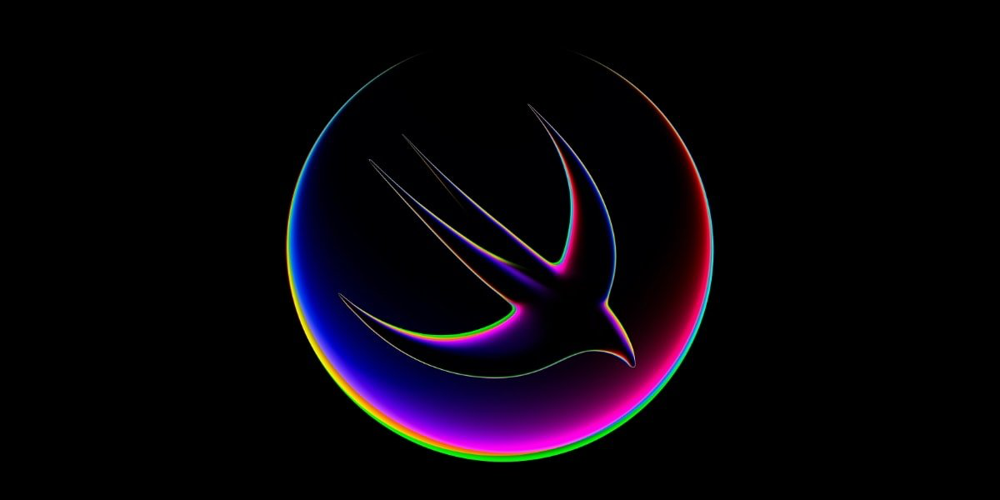

# WWDC 2023 - Swift Student Challenge

List of student submissions for the WWDC 2023 - Swift Student Challenge.

### How to add your submission?
1. [Click here](https://github.com/wwdc/2023/edit/main/Template.md) to fork this repository and edit the `Template.md` file.
2. Fill out the document based on the example in the comment below.
3. Make a new Pull Request and wait for the review.

#### How to update your submission?
If you would like to update your submission status please find your file in `Submission` directory. Edit file, update status and create Pull Request.

### Submissions

| Name | Source |    Video    | Technologies | Status |
|-----:|:------:|:-----------:|:-------------|:------:|
|[Alperen Örence](https://github.com/alperenorence)|[GitHub](https://github.com/alperenorence/HandSignal)|-|SwiftUI, CoreML||
|[Amelia While](https://github.com/elihwyma)|[GitHub](https://github.com/elihwyma/WWDC2023-Semaphores)|-|UIKit, AVFoundation, Vision||
|[Arjun Balakrishnan](https://github.com/balkarjun)|[GitHub](https://github.com/balkarjun/Ciphers)|-|SwiftUI||
|[Bill Chen](https://github.com/billchen2k)|[GitHub](https://github.com/billchen2k/HiSynth)|-|SwiftUI, AVFoundation, SpriteKit||
|[Bryan](https://github.com/bryanless)|[GitHub](https://github.com/bryanless/Assembly-Playground)|-|SwiftUI||
|[Chongin Jeong](https://github.com/chongin12)|[GitHub](https://github.com/chongin12/Sometimes)|[YouTube](https://www.youtube.com/watch?v=qT3PcCvPN44)|SwiftUI, AVFoundation, SpriteKit||
|[Daniel Riege](https://github.com/danielriege)|[GitHub](https://github.com/danielriege/WWDC23-Submission)|-|simd, SceneKit, SwiftUI||
|David Mazzeo|[GitHub](https://github.com/TheIntelCorei9/Swift-Student-Challenge-23)|[YouTube](https://www.youtube.com/watch?v=ViGDWfh0ViA)|simd, SceneKit, SwiftUI||
|[Dayeon Moon](https://github.com/dayo2n)|[GitHub](https://github.com/dayo2n/WWDC23-Swift-Student-Challenge)|[YouTube](https://www.youtube.com/watch?v=NY2yq6vh-M0&t=3s)|SwiftUI||
|[Dohyun Kim](https://github.com/a-mystic)|[GitHub](https://github.com/a-mystic/WWDC2)|-|SwiftUI, UIKit, ARKit, RealityKit, Vision||
|[Frank Chu](https://twitter.com/cyongfrank)|[GitHub](https://github.com/yongfrank/regexgo)|[YouTube](https://www.youtube.com/watch?v=nNWsuZMPHtk)|Swift Regex, RegexBuilder||
|Fred P|[GitHub](https://github.com/fredpi/WWDC2023)|-|SwiftUI, UIKit, SceneKit, ARKit||
|[Gyuri Park](https://github.com/GYURI-PARK)|[GitHub](https://github.com/GYURI-PARK/WWDC2023)|-|SwiftUI, SpriteKit||
|[Henri Bredt](https://twitter.com/henricreates)|[GitHub](https://github.com/henribredt)|[YouTube](https://www.youtube.com/watch?v=0ZGPRZ1uUi0)|SwiftUI||
|[JiaXiang Lu](https://github.com/sdfsdfsv)|[GitHub](https://github.com/sdfsdfsv/The-Mountain-Wwdc23)|-|SwiftUI, MetalKit||
|[Jinha Byeon](https://github.com/Byeonjinha)|[GitHub](https://github.com/Byeonjinha/MyStarryCompanion)|[YouTube](https://www.youtube.com/watch?v=9WZQ4pwnIjo)|SwiftUI||
|[John Seong](https://johnseong.info)|[GitHub](https://github.com/wonmor/Atomizer-Swift-Challenge)|[YouTube](https://www.youtube.com/watch?v=kHcdvyaqslU)|SwiftUI, SceneKit, ARKit, Vision||
|[Jonathan](https://fuzzynat26.github.io/personal/)|[GitHub](https://github.com/FuzzyNat26/light-pollution)|-|SwiftUI, AVFoundation||
|[Jong Myeong Ha](https://github.com/hhajime)|[GitHub](https://github.com/hhajime/Sensit-WWDC-2023-Swift-Student-Challenge)|-|SwiftUI, AVFoundation, Accerate, Combine||
|[Jose Adolfo Talactac](https://twitter.com/devjoseadolfo)|[GitHub](https://github.com/devjoseadolfo/LogicBoard)|[YouTube](https://youtu.be/Pg_R5nvF2Tw)|SwiftUI, SpriteKit, UIKit||
|[José María PF](https://github.com/clxsrdev)|[GitHub](https://github.com/clxsrdev/Mixin-UP)|[YouTube](https://youtu.be/qkMU5xHEZ_8)|SwiftUI||
|[Juraj Kebis](https://github.com/vector23)|[GitHub](https://github.com/vector23/Planties)|-|SwiftUI, SpriteKit, UIKit||
|[Myung Geun Choi](https://github.com/mgdgc)|[GitHub](https://github.com/mgdgc/earth-debugger)|[YouTube](https://youtu.be/prc4jeNdFfA)|SwiftUI||
|[Omar Abu Sharar](https://github.com/omarabusharar)|[GitHub](https://github.com/omarabusharar/ssc-2023)|[YouTube](https://www.youtube.com/watch?v=aL7OD8BxTJ8)|SwiftUI, SpriteKit||
|[René Martínez Villaseñor](https://github.com/dmcpacks)|[GitHub](https://github.com/dmcpacks/mexicoclicker)|[YouTube](https://www.youtube.com/watch?v=9eQXIoK-RDg)|SwiftUI, AVFoundation, AVKit||
|[Riccardo Persello](https://github.com/persello)|[GitHub](https://github.com/persello/ssc23)|-|Accelerate, AVFoundation, SwiftUI, Vision||
|[Rithul Kamesh](https://github.com/rithulkamesh)|[GitHub](https://github.com/rithulkamesh/fitness)|-|SwiftUI||
|[Samion Suwito](https://github.com/isitusnoamow)|[GitHub](https://github.com/isitusnoamow/cells-wwdc2023)|-|SwiftUI, SpriteKit, Core Graphics||
|[Ungjae Lee](https://github.com/NuPlay)|[GitHub](https://github.com/NuPlay/DropUI)|-|SwiftUI, PencilKit||
|[Vincent Cai](https://www.instagram.com/vince14genius_0/)|[GitHub](https://github.com/Vince14Genius/My-WWDC-Swift-Student-Challenge-submissions)|-|SwiftUI||
|[Xianhao Liu](https://github.com/Carton22)|[GitHub](https://github.com/Carton22/Handbot)|[YouTube](https://youtu.be/AQyzqk6_YjY)|SwiftUI, UIKit, PencilKit, AVFoundation||
|[Yanan Li](https://github.com/liyanan2004)|-|[YouTube](https://youtu.be/2CStbcJK0qM)|SwiftUI, Swift Charts||
|[Yi Cao](https://github.com/xiaoyu2006)|[GitHub](https://github.com/xiaoyu2006/IFS)|-|SwiftUI, UIKit||
|[Yujin Lee](https://github.com/yujinnee)|[GitHub](https://github.com/yujinnee/WorldHunter)|[YouTube](https://www.youtube.com/watch?v=rlxRgopwPkE)|SwiftUI, UIKit, SceneKit, ARKit||
|[Yunho Oh](https://github.com/helloyunho)|[GitHub](https://github.com/helloyunho/sound-playgrounds)|-|SwiftUI, AVFoundation||

##### Total: 35 | Accepted: 24
